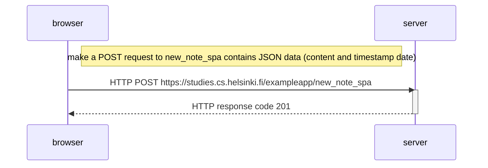

```mermaid
sequenceDiagram
    participant browser
    participant server
    
    Note right of browser: make a POST request to new_note_spa contains JSON data (content and timestamp date)
    
    browser->>server: HTTP POST https://studies.cs.helsinki.fi/exampleapp/new_note_spa
    activate server
    server-->>browser: HTTP response code 201
    deactivate server    

```
