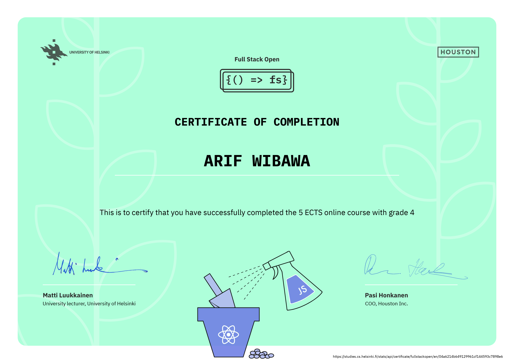

# Deep Dive Into Modern Web Development

## [Full Stack Open 2022](https://fullstackopen.com/en/)

Learn React, Redux, Node.js, MongoDB, GraphQL, TypeScript, React Native, GitHub Actions and Docker in one go! This course will introduce you to modern JavaScript-based web development. The main focus is on building single page applications with ReactJS that use REST APIs built with Node.js.

### [Part 0 - Fundamentals of Web apps](https://fullstackopen.com/en/part0)

- General Info
- Fundamentals of Web apps

### [Part 1 - Introduction to React](https://fullstackopen.com/en/part1)

- Introduction to React
- JavaScript
- Component State, event handlers
- A more complex state, debugging React apps

### [Part 2 - Communicating with server](https://fullstackopen.com/en/part2)

- Rendering a collection, modules
- Forms
- Getting data from server
- Altering data in server
- Adding style to React apps

### [Part 3 - Programming a server with NodeJS and Express](https://fullstackopen.com/en/part3)

- Node.js and Express
- Deploying app to internet
- Saving data to MongoDB
- Validation and ESLint

### [Part 4 - Testing Express servers, user administration](https://fullstackopen.com/en/part4)

- Structure of backend application, introduction to testing
- Testing and backend
- User administration
- Token administration

## Course Certificates

### Full Stack Certificate - Parts 0-4

  

