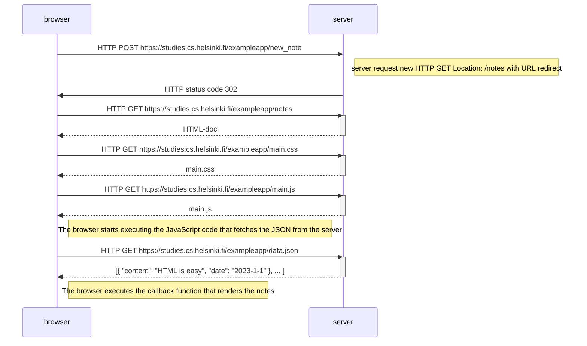
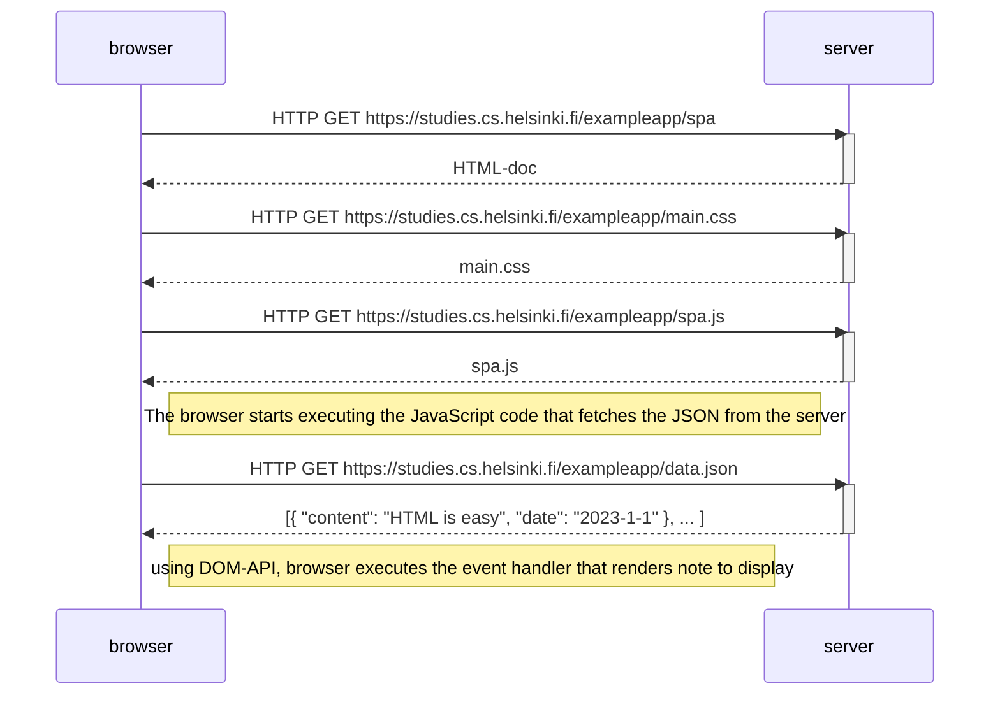
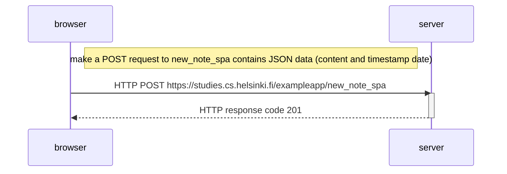

# [part0 Exercise Solutions](https://fullstackopen.com/en/part0/fundamentals_of_web_apps#exercises-0-1-0-6)

## 0.4: new note

```mermaid
sequenceDiagram
    participant browser
    participant server
    
    browser->>server: HTTP POST https://studies.cs.helsinki.fi/exampleapp/new_note
    Note right of server: server request new HTTP GET Location: /notes with URL redirect
    server->>browser: HTTP status code 302
    
    browser->>server: HTTP GET https://studies.cs.helsinki.fi/exampleapp/notes
    activate server
    server-->>browser: HTML-doc
    deactivate server
    
    browser->>server: HTTP GET https://studies.cs.helsinki.fi/exampleapp/main.css
    activate server
    server-->>browser: main.css
    deactivate server
    
    browser->>server: HTTP GET https://studies.cs.helsinki.fi/exampleapp/main.js
    activate server
    server-->>browser: main.js
    deactivate server
    
    Note right of browser: The browser starts executing the JavaScript code that fetches the JSON from the server
    
    browser->>server: HTTP GET https://studies.cs.helsinki.fi/exampleapp/data.json
    activate server
    server-->>browser: [{ "content": "HTML is easy", "date": "2023-1-1" }, ... ]
    deactivate server    
    Note right of browser: The browser executes the callback function that renders the notes 
```

## 0.5: Single page app

```mermaid
sequenceDiagram
    participant browser
    participant server
    
    browser->>server: HTTP GET https://studies.cs.helsinki.fi/exampleapp/spa
    activate server
    server-->>browser: HTML-doc
    deactivate server
    
    browser->>server: HTTP GET https://studies.cs.helsinki.fi/exampleapp/main.css
    activate server
    server-->>browser: main.css
    deactivate server
    
    browser->>server: HTTP GET https://studies.cs.helsinki.fi/exampleapp/spa.js
    activate server
    server-->>browser: spa.js
    deactivate server
    
    Note right of browser: The browser starts executing the JavaScript code that fetches the JSON from the server
    
    browser->>server: HTTP GET https://studies.cs.helsinki.fi/exampleapp/data.json
    activate server
    server-->>browser: [{ "content": "HTML is easy", "date": "2023-1-1" }, ... ]
    deactivate server    
    Note right of browser: using DOM-API, browser executes the event handler that renders note to display
```

## 0.6: New note

```mermaid
sequenceDiagram
    participant browser
    participant server
    
    Note right of browser: make a POST request to new_note_spa contains JSON data (content and timestamp date)
    
    browser->>server: HTTP POST https://studies.cs.helsinki.fi/exampleapp/new_note_spa
    activate server
    server-->>browser: HTTP response code 201
    deactivate server    
```
